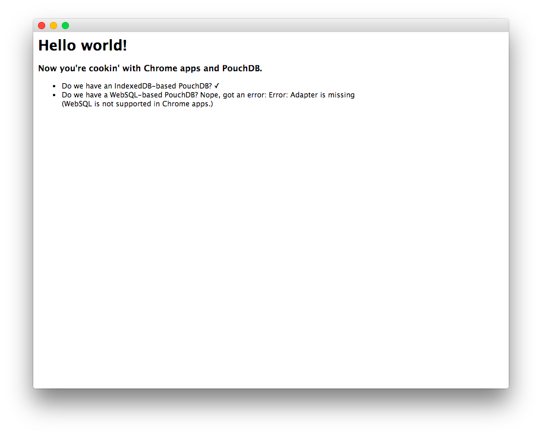

"Hello world" Chrome app using PouchDB
========

This is a sample app showing how to use PouchDB in a Chrome packaged app.

It demonstrates that you can load PouchDB and that the IndexedDB adapter (i.e. the default adapter) works. (WebSQL is not allowed in Chrome packaged apps.)

The app looks like this:



Running
-------

To run the app in Mac OS X, just clone the code, make sure that you've installed Chrome, and run:

```
./run-mac-osx.sh
```

To run it in Windows, find where you installed Chrome, locate `chrome.exe`, and run:

```
./path/to/chrome.exe --load-and-launch-app=.
```

In Linux, again find the `chrome` executable, and run:

```
./path/to/chrome --load-and-launch-app=.
```